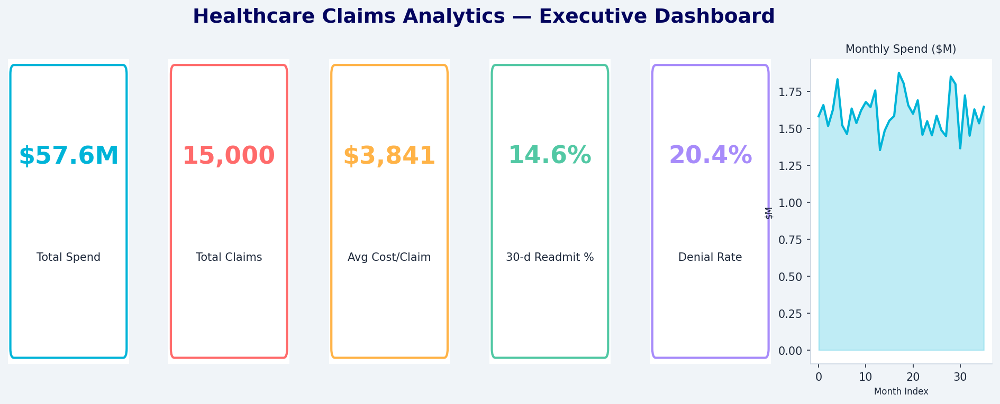
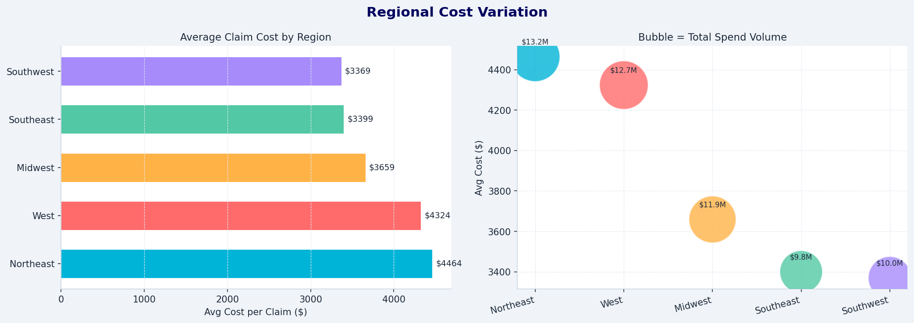
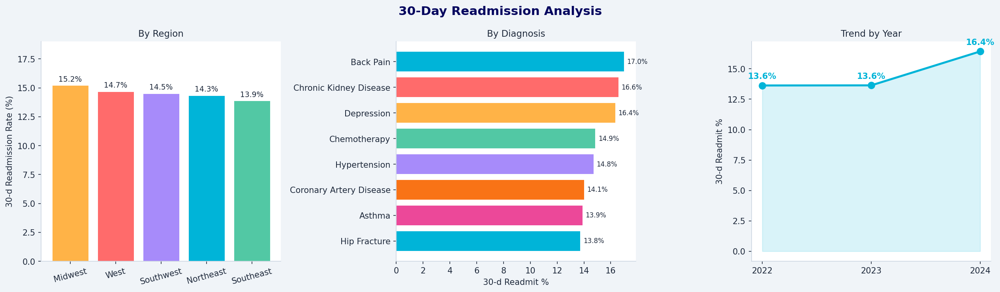
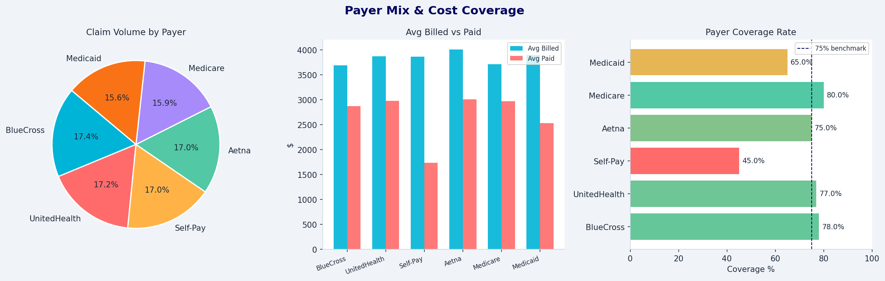
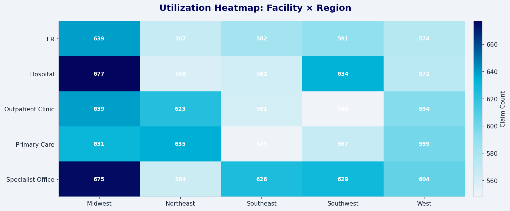
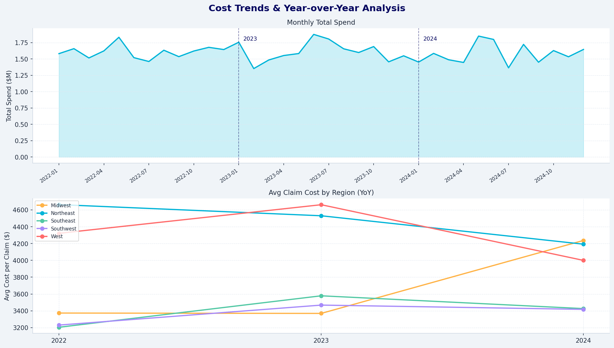
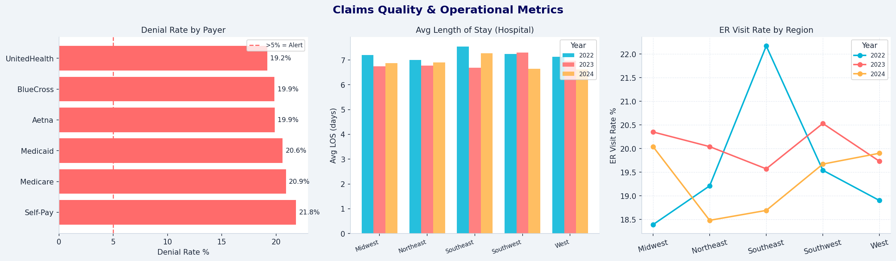
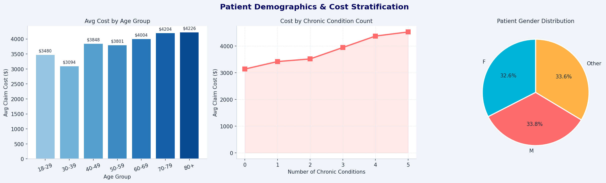

# 🏥 Healthcare Claims Analytics Dashboard

> **End-to-end healthcare data analytics project** — from raw synthetic claims data to interactive dashboards — built with Python, SQL, Tableau, and Power BI.

[](https://python.org)
[](https://sqlite.org)
[](https://tableau.com)
[](https://powerbi.microsoft.com)
[](LICENSE)

---

## 🌐 Live Dashboard

**[→ View Interactive Dashboard]([https://your-username.github.io/healthcare-claims-analytics/dashboard.html](https://github.com/cyn-crypto/Healthcare-Claims-Analytics-Dashboard-/blob/644aac57e059a74ca8d7ae962928434552d6fb48/dashboard.html))**

> Browse all 8 analytics panels directly in your browser — no setup required.

---

## 📊 Dashboard Previews

| Executive KPI Summary | Regional Cost Variation |
|:---------------------:|:-----------------------:|
|  |  |

| 30-Day Readmission Analysis | Payer Mix & Coverage |
|:---------------------------:|:--------------------:|
|  |  |

| Utilization Heatmap | Cost Trends (YoY) |
|:-------------------:|:-----------------:|
|  |  |

| Quality & Operational Metrics | Patient Demographics |
|:-----------------------------:|:--------------------:|
|  |  |

---

## 🗂️ Project Structure

```
healthcare-claims-analytics/
├── data/
│   ├── patients.csv              # 2,000 synthetic patients
│   ├── claims.csv                # 15,000 claims (2022–2024)
│   └── quality_metrics.csv       # Regional quality KPIs
├── sql/
│   └── analytics_queries.sql     # Schema + 20+ analytical queries
├── python/
│   ├── generate_data.py          # Synthetic data generator
│   ├── analytics.py              # Full analytics + chart pipeline
│   └── data_validation.py        # 10 QC checks
├── dashboard/
│   ├── 01_kpi_summary.png … 08_demographics.png
│   ├── healthcare_claims_analytics.xlsx
│   ├── tableau_setup_guide.xml
│   └── powerbi_setup.m
├── dashboard.html                # Self-contained interactive viewer
├── requirements.txt
└── README.md
```

---

## 🚀 Quick Start

```bash
git clone https://github.com/your-username/healthcare-claims-analytics.git
cd healthcare-claims-analytics
pip install -r requirements.txt
python python/generate_data.py
python python/data_validation.py
python python/analytics.py
open dashboard.html
```

---

## 🔍 Key Analyses

- **Utilization** — monthly claim volume, facility mix, top diagnoses & procedures
- **Cost** — regional variation, payer coverage rates, high-cost cohort (top 5%)
- **Readmissions** — 30-day rates by region, diagnosis, year & chronic condition count
- **Quality** — denial rates by payer, avg LOS, ER visit rates, YoY comparisons
- **Data Validation** — 10 automated QC checks (nulls, orphans, duplicates, anomalies)

---

## 📋 Key Findings

- **Northeast & West** regions show ~25% higher avg claim costs vs Southwest
- **30-day readmission rates** rise ~2% per additional chronic condition
- **Self-Pay** patients bear ~55% of billed costs out-of-pocket
- **Top 5% high-cost patients** account for ~40% of total spend
- **Denial rates >5%** flagged across two payers — an improvement opportunity

---

## 🛠️ Tech Stack

| Layer | Tools |
|-------|-------|
| Data Generation | Python, NumPy, Pandas |
| Storage & Queries | SQLite, SQL (CTEs, window functions, views) |
| Validation | Python — 10 automated QC rules |
| Visualization | Matplotlib — 8 dashboard panels |
| BI Export | OpenPyXL — 6-sheet Excel workbook |
| BI Dashboards | Tableau / Power BI (xlsx import) |
| Web Viewer | Self-contained HTML (no server needed) |

---

## 📄 License

MIT — free to use, adapt, and build on.
